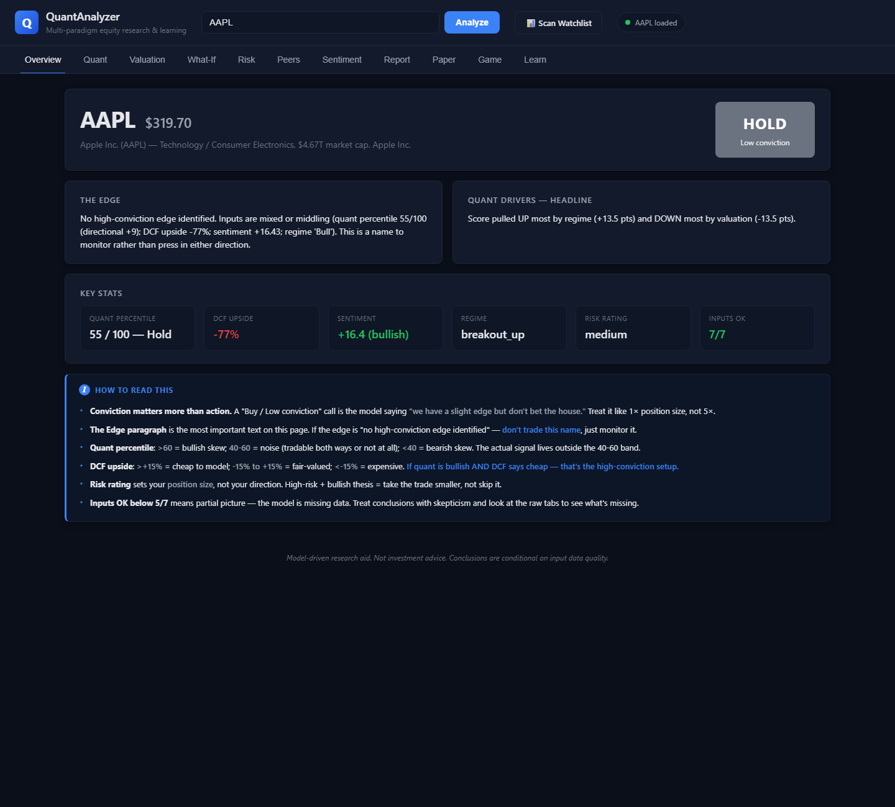
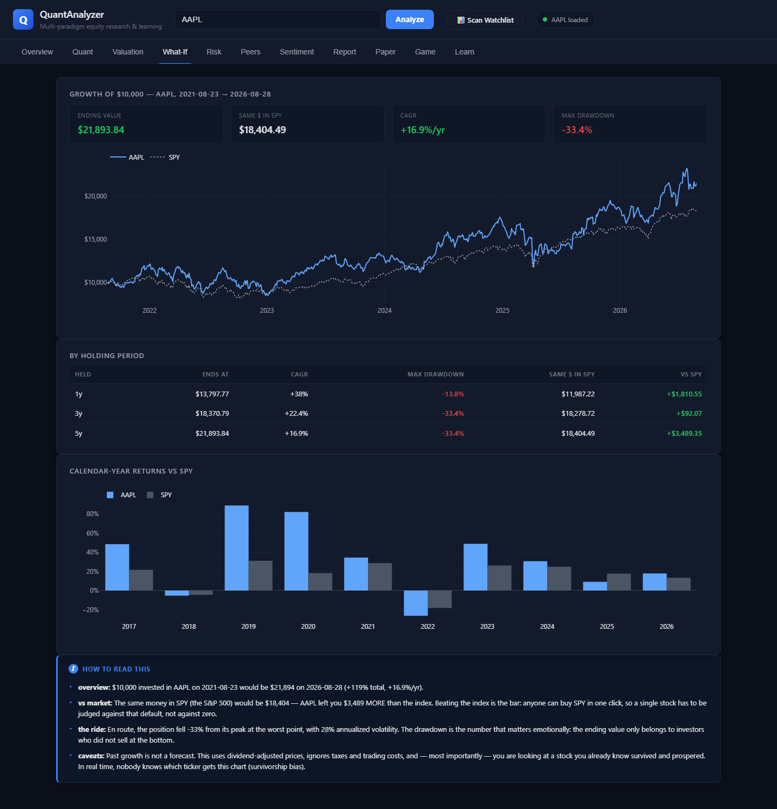
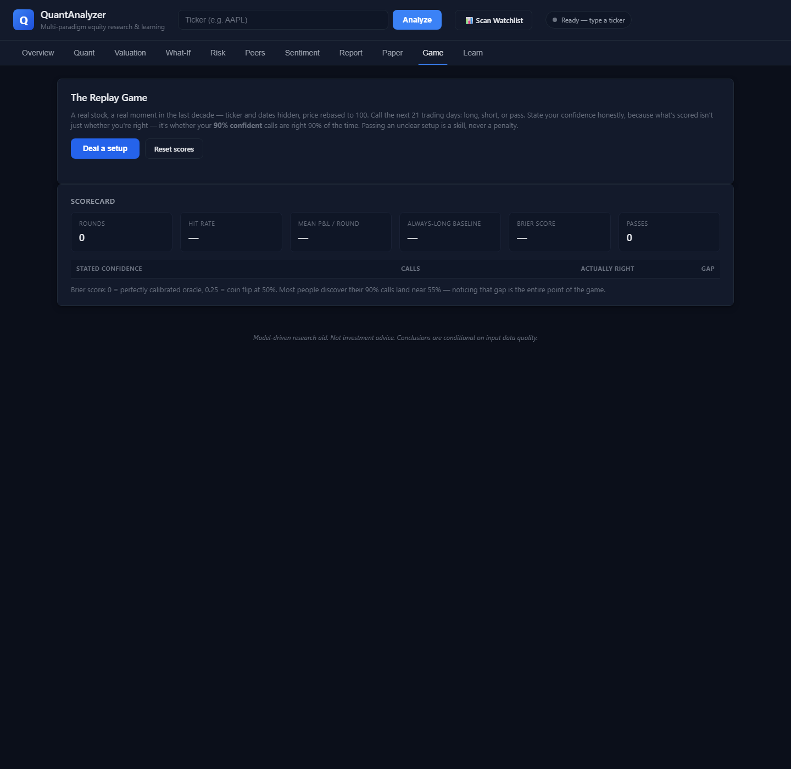
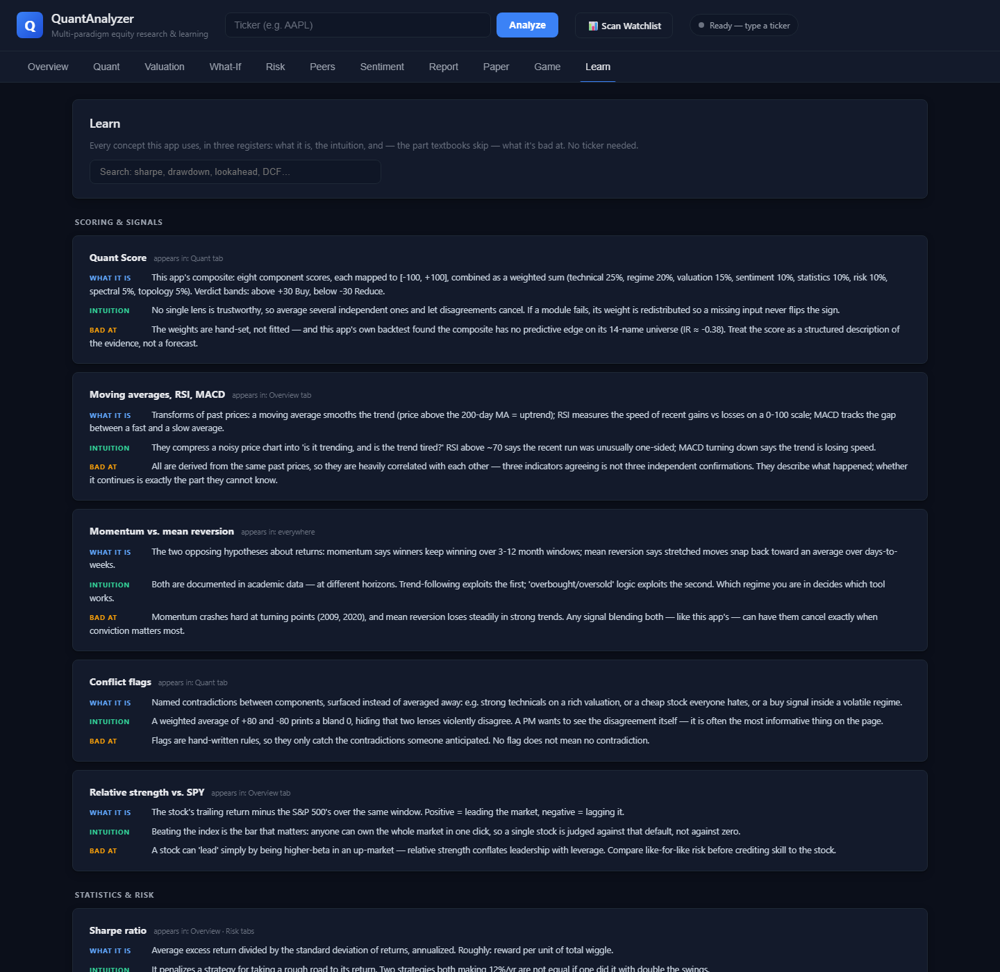

# QuantAnalyzer

A multi-paradigm equity research and learning platform, built solo by a Fox Fund member. Enter a ticker and get a structured quantitative diagnostic — every number paired with a plain-English explanation of what it is, why it matters, and **what it's bad at**. Then act on it: run a what-if, paper trade it, or test yourself against blind history in the Replay Game.



## The honest headline

This project backtested its own composite signal point-in-time across its 14-ticker watchlist (518 ticker-months, 2023–2026) and found **no predictive edge**: annualized IR ≈ **−0.38**, mean cross-sectional IC ≈ −0.034 (t = −0.66), with inverted extreme quintiles. A companion timing test found the signal trails SPY on 11 of 14 names (mean alpha ≈ −22%).

That result is reported everywhere in the app instead of hidden — because the platform's real product is **teaching how quantitative claims are made and broken**: the universe is survivorship-biased, the names are correlated (so 518 observations ≈ 37 effective ones), and the weights are in-sample. Full evidence: [`scripts/_watchlist_backtest_v2.log`](scripts/_watchlist_backtest_v2.log), [`scripts/_watchlist_alpha_check_output.txt`](scripts/_watchlist_alpha_check_output.txt). Making these numbers defensible requires a point-in-time, delisting-inclusive universe — see [FUNDING_PROPOSAL.md](FUNDING_PROPOSAL.md).

## The eleven tabs

**Research** (per ticker)
| Tab | What it does |
|---|---|
| **Overview** | Composite verdict with conviction, the edge paragraph, key stats, how-to-read guide |
| **Quant** | 8-component Quant Score breakdown — technical, HMM regime, valuation, sentiment, statistics, spectral, topology, risk — with conflict flags |
| **Valuation** | Bull/base/bear DCF triangulation (3-yr average FCF base), sensitivity matrix, peer-relative read |
| **What-If** | Growth of $10,000 vs the same money in SPY per holding period — with the max drawdown you had to sit through to earn it |
| **Risk** | Historical + parametric VaR/CVaR, GARCH vol forecast, stress scenarios, drawdown chart |
| **Peers** | Multiples vs a curated cohort; relative-value score is purely fundamental (momentum shown but deliberately not scored) |
| **Sentiment** | VADER over live headlines, time-weighted, with every headline listed and linked |
| **Report** | Full sell-side-style research note assembled from every module |

**Learning & practice** (no ticker needed)
| Tab | What it does |
|---|---|
| **Paper** | Simulated $100k account — market orders at latest close, average-cost P&L, honest about the fact that free fills flatter results |
| **Game** | **The Replay Game**: a real stock at a real hidden moment, price rebased to 100. Call the next 21 days — long, short, or pass — with a stated confidence. Scored on *calibration* (Brier score, stated-vs-realized table), not just wins |
| **Learn** | 34-term glossary in three registers: what it is, the intuition, and what it's bad at |





## Tech stack

FastAPI (async) · yfinance · pandas / numpy / scipy · scikit-learn · hmmlearn · ripser · umap-learn · arch · vaderSentiment · vanilla JS + Plotly · SQLite locally / Postgres when deployed · ReportLab (PDF)

Every analysis module follows one convention: `compute() → dataclass → to_dict() → endpoint`, each with an `explanations` dict and a smoke test.

## Run locally

```bash
git clone https://github.com/Marik58/quantanalyzer && cd quantanalyzer
python -m venv .venv
# Windows: .venv\Scripts\activate      macOS/Linux: source .venv/bin/activate
pip install -r requirements.txt
python -m uvicorn backend.main:app --host 127.0.0.1 --port 8000
```

Open http://127.0.0.1:8000 after "Application startup complete." prints (first boot imports ~25 analysis modules, ~15s).

**Handy deep links:** `/?t=AAPL` analyzes on load; add a hash to land on a tab — `/?t=NVDA#whatif`, `/#game`, `/#learn`.

**Before a demo:** `python scripts/warm_cache.py` pre-fetches every watchlist ticker so nothing waits on Yahoo live.

## Tests

```bash
python scripts/run_all_tests.py          # 21 modules, asserted invariants
python scripts/run_all_tests.py --full   # + the slow walk-forward backtest
```

The suite includes leakage tests for the game (no ticker, no dates, rebased prices) and full lifecycle tests for paper trading.

## Deploy (Render free tier)

Push to GitHub → Render → **New + → Blueprint** → pick the repo. [render.yaml](render.yaml) provisions the web service **and a free Postgres** wired in via `DATABASE_URL`, so watchlist / paper / game state survives restarts. Locally, no `DATABASE_URL` means plain SQLite — zero setup.

## Constraints

- Data: yfinance only (free) — which is exactly why fundamentals/sentiment sit out of the backtest (no point-in-time history) and why every backtest result carries a survivorship caveat
- Windows-friendly: every dependency ships wheels; no C++ toolchain required
- Built incrementally, one module at a time, each tested before the next

## Disclaimer

For research and education only. **Not financial advice.** Past performance does not guarantee future results — this app's own backtest is the proof.
