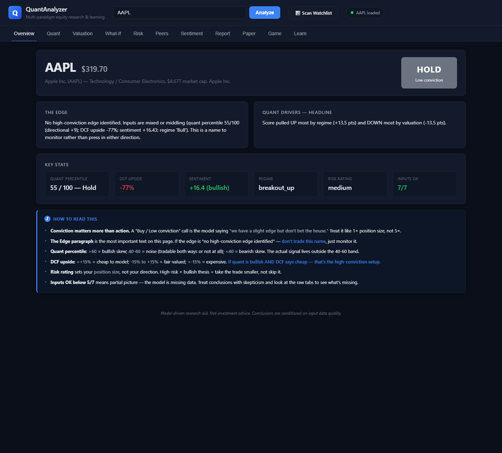
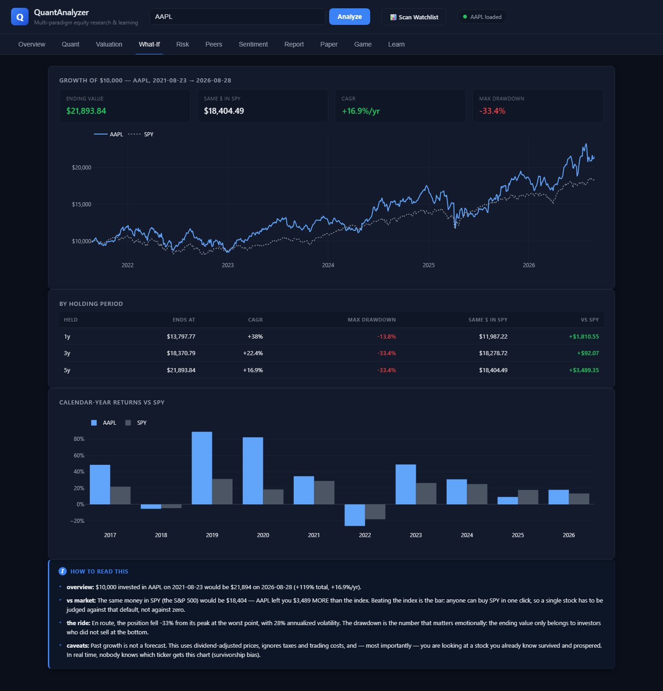
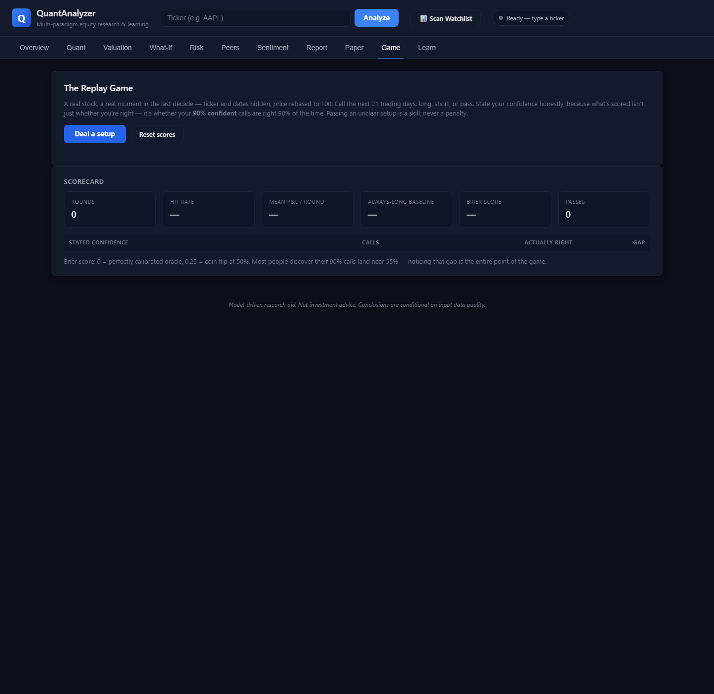
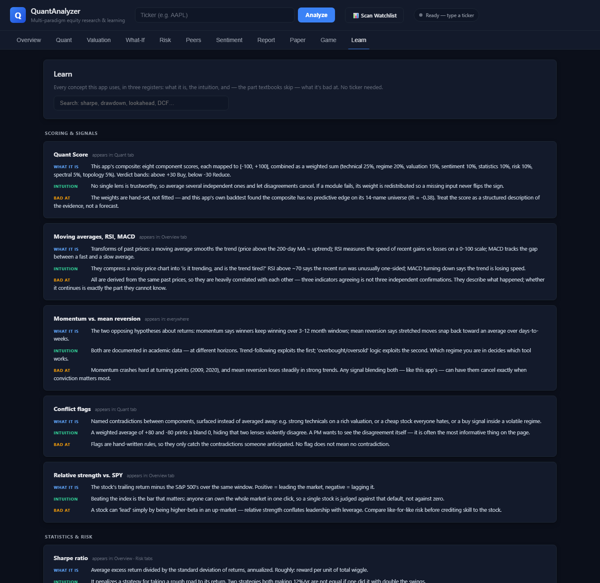

# QuantAnalyzer

A research and learning platform for studying stocks, built solo by a college student. Enter a ticker and get a structured quantitative diagnostic, with every number paired with a plain-English explanation of what it is, why it matters, and **what it's bad at**.

## Where this is going

QuantAnalyzer is being rebuilt around **a panel of AI agents**. Each agent studies stocks through one lens (business growth, value, price trends, news, public hype, the economy, supply chains) under its own written rules about what it may see and how it must reason. Every call is saved with the exact evidence behind it and graded later against fair benchmarks:
- the agent's own list of candidates
- a base-rate forecaster
- a coin flip
- the S&P 500
- a factor-adjusted check

A referee agent checks every call for made-up numbers and broken rules. Rule-based versions of each strategy are backtested on decades of history first, because an AI model can't be honestly backtested on years it has already read about.

- **The plan:** [ROADMAP.md](ROADMAP.md)
- **The agents, their rules, and how they're judged:** [docs/AGENT_CHARTERS.md](docs/AGENT_CHARTERS.md)

The app described below is the current version. Roadmap Phase 2 reorganizes it around the agent panel. Older planning documents are in [docs/archive/](docs/archive/).



## The honest headline

This project backtests its own composite signal and reports that it has **no measurable predictive edge**. Two independent tests agree:

| Universe | Ticker-months | Mean IC | t-stat | Annualized IR |
|---|---|---|---|---|
| 14-ticker watchlist | 518 | −0.027 | −0.46 | **−0.26** |
| 200 S&P 500 members, point-in-time | 6,662 | +0.010 | +0.35 | **+0.20** |

Neither is distinguishable from zero (both need |t| ≥ 2). On the broad universe the long-short portfolio earns +0.31% per rebalance gross and **+0.04% net** of 10bps costs, score quintiles run backwards, and no component survives a Benjamini-Hochberg correction. Adjusting the watchlist result for Fama-French 5 + momentum gives alpha ≈ −19%/yr (t = −0.99). An earlier 80-name pilot printed IR +0.66; tripling the sample cut it to +0.20, which is what sampling noise does and a real edge does not.

That result is reported openly instead of hidden, and it is the first entry on the new scoreboard. It's also why every future claim in this project has to beat fair benchmarks. The caveats matter too:
- The watchlist names are correlated, so 518 observations are worth about 37 independent ones.
- The weights were chosen in-sample.
- Even the point-in-time run is missing 13 of 200 names, all of them index leavers, which biases it upward.

Full evidence:
- [`scripts/_watchlist_backtest_v3.log`](scripts/_watchlist_backtest_v3.log) (14 names, after the September audit fixes)
- [`scripts/_universe_pilot_n80.log`](scripts/_universe_pilot_n80.log)
- [`scripts/_universe_pilot_n200.log`](scripts/_universe_pilot_n200.log)
- [`scripts/_watchlist_alpha_check_output.txt`](scripts/_watchlist_alpha_check_output.txt)

Making these numbers fully defensible requires a delisting-inclusive universe (CRSP), which free data can't provide.

## The twelve tabs

**Research** (per ticker)
| Tab | What it does |
|---|---|
| **Overview** | Composite verdict with conviction, the edge paragraph, key stats, how-to-read guide |
| **Quant** | 8-component Quant Score breakdown — technical, HMM regime, valuation, sentiment, statistics, spectral, topology, risk — with conflict flags |
| **Valuation** | Bull/base/bear DCF triangulation (3-yr average FCF base), sensitivity matrix, peer-relative read |
| **What-If** | Growth of $10,000 vs the same money in SPY per holding period — with the max drawdown you had to sit through to earn it |
| **Risk** | Historical + Student-t parametric VaR/CVaR, beta-scaled stress scenarios, drawdown chart, Kelly sizing |
| **Peers** | Multiples vs a curated cohort; relative-value score is purely fundamental (momentum shown but deliberately not scored) |
| **Sentiment** | VADER over live headlines, time-weighted, with every headline listed and linked |
| **Report** | Full sell-side-style research note assembled from every module |

**Learning & practice** (no ticker needed)
| Tab | What it does |
|---|---|
| **Paper** | Simulated $100k account — market orders at latest close, average-cost P&L, honest about the fact that free fills flatter results |
| **Game** | **The Replay Game**: a real stock at a real hidden moment, price rebased to 100. Call the next 21 days — long, short, or pass — with a stated confidence. Scored on *calibration* (Brier score, stated-vs-realized table), not just wins |
| **Crisis** | How a stock, and the app's own regime and risk diagnostics, behaved through four real shocks: the 2020 COVID crash, the 2022 rate shock, the 2023 SVB collapse, and the August 2024 volatility spike |
| **Learn** | 34-term glossary in three registers: what it is, the intuition, and what it's bad at |





## Tech stack

FastAPI (async) · yfinance · pandas / numpy / scipy · scikit-learn · hmmlearn · ripser · umap-learn · vaderSentiment · vanilla JS + Plotly · SQLite locally / Postgres when deployed · ReportLab (PDF)

Every analysis module follows one convention: `compute() → dataclass → to_dict() → endpoint`, each with an `explanations` dict and a smoke test.

## Run locally

```bash
git clone https://github.com/Marik58/quantanalyzer && cd quantanalyzer
python -m venv .venv
# Windows: .venv\Scripts\activate      macOS/Linux: source .venv/bin/activate
pip install -r requirements.txt
python -m uvicorn backend.main:app --host 127.0.0.1 --port 8000
```

Open http://127.0.0.1:8000 after "Application startup complete." prints (first boot imports ~25 analysis modules, ~15s).

**Handy deep links:** `/?t=AAPL` analyzes on load; add a hash to land on a tab — `/?t=NVDA#whatif`, `/#game`, `/#learn`.

**Before a demo:** `python scripts/warm_cache.py` pre-fetches every watchlist ticker so nothing waits on Yahoo live.

## Tests

```bash
python scripts/run_all_tests.py          # 28 modules, asserted invariants
python scripts/run_all_tests.py --full   # + the slow walk-forward backtest
```

The suite includes leakage tests for the game (no ticker, no dates, rebased prices) and full lifecycle tests for paper trading.

## Deploy (Render free tier)

Push to GitHub → Render → **New + → Blueprint** → pick the repo. [render.yaml](render.yaml) provisions the web service only. Render's free Postgres expires after 30 days, so for state that survives restarts, create a free permanent database (for example Neon) and set it as the `DATABASE_URL` environment variable in the Render dashboard (the steps are in the comments at the top of `render.yaml`). Locally, no `DATABASE_URL` means plain SQLite, with zero setup.

## Constraints

- Data: yfinance only (free) — which is exactly why fundamentals/sentiment sit out of the backtest (no point-in-time history) and why every backtest result carries a survivorship caveat
- Windows-friendly: every dependency ships wheels; no C++ toolchain required
- Built incrementally, one module at a time, each tested before the next

## Disclaimer

For research and education only. **Not financial advice.** Past performance does not guarantee future results — this app's own backtest is the proof.
